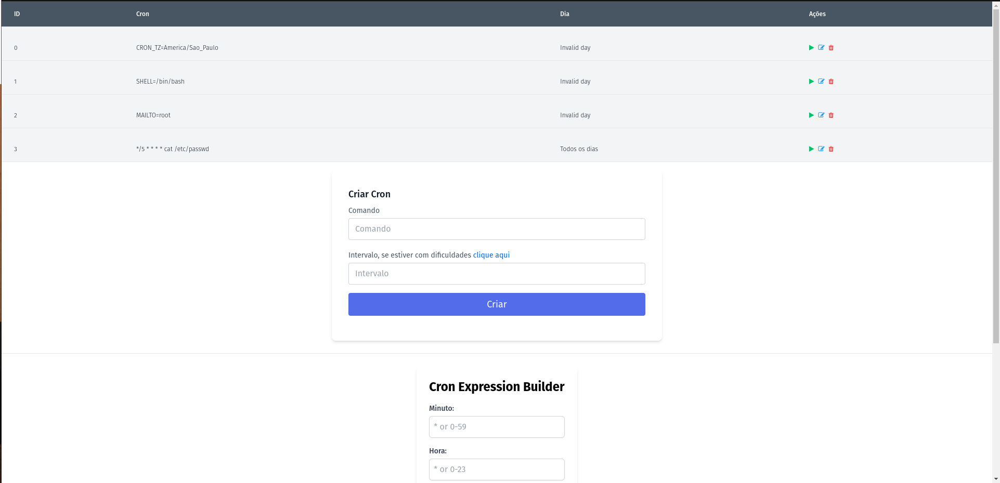

# Cron Manager

## Instalação das Libs
```console
python3 -m pip install -r requirements.txt
```

## Comandos Customizados

### Gerar chave secreta
```console
python3 manage.py generate_secret_key
```
### Formatar arquivos: .py, .html, .js, .css
```console
python3 manage.py format_code
```

## Exemplo

